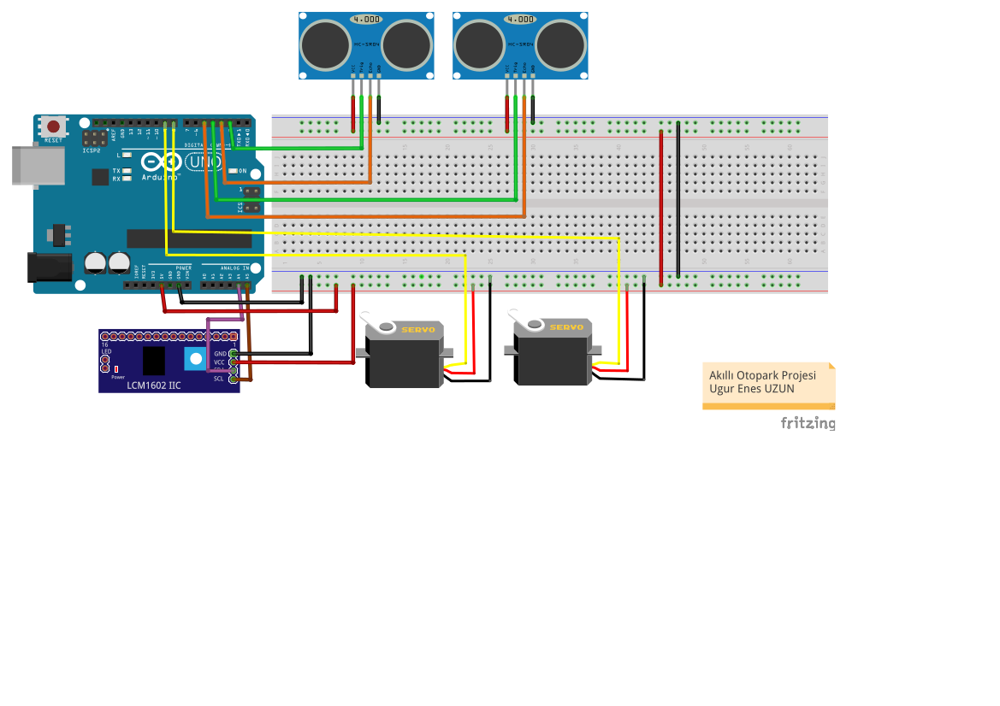

# Arduino Otopark Projesi

## References

**Ultrasonic sensor SR04**

https://howtomechatronics.com/tutorials/arduino/ultrasonic-sensor-hc-sr04/

**LCD(Liquid crystal display) LCM1602 IIC**

https://arduinoinfo.mywikis.net/wiki/LCD-Blue-I2C

**Electronic Circuit Design (.fzz files)**

https://fritzing.org/

